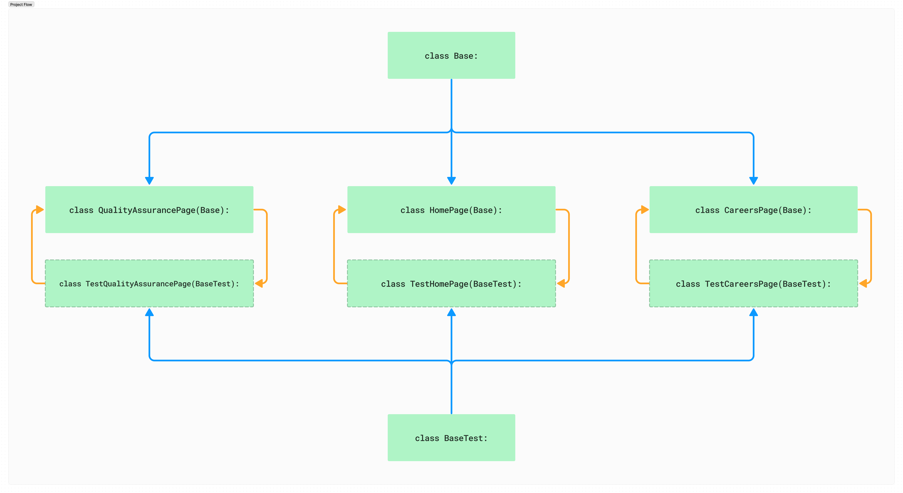

# Insider QA - Case Study

### **Case Study**

1. Visit the Insider home page ([https://useinsider.com/](https://useinsider.com/)) and check if it is opened.
2. Select the “Company” menu in the navigation bar, choose “Careers,” and verify if the Career page is opened.
   Additionally, check if the Locations, Teams, and Life at Insider blocks are visible.
3. Navigate to the Quality Assurance
   page ([https://useinsider.com/careers/quality-assurance/](https://useinsider.com/careers/quality-assurance/)), click
   on "See all QA jobs," filter the jobs by Location: “Istanbul, Turkey,” and Department: “Quality Assurance.” Verify
   the presence of the job list.
4. Ensure that all jobs' Position contains “Quality Assurance,” Department contains “Quality Assurance,” and Location
   contains “Istanbul, Turkey.”
5. Click the “View Role” button and verify that this action redirects to the Lever Application form page.

# Project Details

This project includes UI automation tests for the UseInsider website. Test cases have been prepared for the homepage,
Careers, and QualityAssurancePage. The project is written using Python's Pytest library. The tests are executed on
Chrome and Mozilla browsers.

### Project Video

[Testing Videos (Youtube)](https://youtu.be/SBDv5bda5rM)

## Folder Structure

    |   .env
    |   .gitignore
    |   README.md
    |   report.html
    |   requirements.txt
    |   testing_video.mp4   
    +---assets
    |   |   style.css
    |   |   
    +---configs
    |   |   constants.py
    |   |   __init__.py
    |   |   
    +---pages
    |   |   base.py
    |   |   careersPage.py
    |   |   homePage.py
    |   |   qualityAssurancePage.py
    |   |   __init__.py
    |   |   
    +---testCases
    |   |   test_base.py
    |   |   test_careersPage.py
    |   |   test_homePage.py
    |   |   test_qualityAssurancePage.py
    |   |   __init__.py

---
**config/:** The folder where the configuration files of the project are located.

- **init.py:** The file where the configuration of the WebDriver is specified
- **constants.py:** The file where constant variables are located.

**pages/:** The folder where methods specific to each page are stored when writing tests.

- **base.py:** The file containing global methods that can be used in every test scenario. Page-specific classes inherit
  from the class within this file.
- **homePage.py:** The file containing methods specific to the homepage
- **careersPage.py:** The file containing methods specific to the Careers page (CareersPage).
- **qualityAssurancePage.py:** The file containing methods specific to the Quality Assurance page (QualityAssurancePage).
- **test_base.py:** In the config/__init__.py file, the WebDriver defined is marked as a fixture within this file. This
  way, the driver is defined as an argument in all test cases.
- **test_homePage.py:** The file containing test cases related to the homepage (HomePage).
- **test_careersPage.py:** The file containing test cases related to the Careers page (CareersPage).
- **test_qualityAssurancePage.py:** The file containing test cases related to the Quality Assurance page (QualityAssurancePage).

## Run Command

    pytest -v --html=report.html

# Test Steps

### test_homePage.py

This test file contains 2 tests:

1. Test:
    - Opens the page https://useinsider.com/.
    - Closes the cookie alert if present
    - Checks the existence of the `router.home-page` element.
    - If it exists, the test is successful.
2. Test:
    - Clicks on the  "**Company**"  button from the Company header menu.
    - Then clicks on the "**Careers**" button from the opened menu.
    - Checks the existence of the `router.career-page` element.
    - If it exists, the test is successful.

### test_careerPage.py

This file contains 3 tests:

1. Test:
    - Opens the Careers page.
    - Closes the cookie alert if present.
    - Scrolls to the locations on the page (waits for 0.7 seconds; this delay is due to the animated scroll, and the
      code is paused for 0.7 seconds).
    - Creates an empty list named `actual_our_locations_list`.
    - Adds locations to this list
    - Compares the `result_location_list` constant with the actual locations.
    - If the results match, the test is successful
2. Test:
    - Scrolls to the department list (waits for 0.7 seconds; this delay is due to the animated scroll, and the code is
      paused for 0.7 seconds).
    - Clicks on the See All Teams button.
    - Creates an empty list named `actual_departments_list`.
    - Adds departments to this list.
    - Compares the `result_departments_list` constant with the actual departments.
    - If the results match, the test is successful.
3. Test:
    - Checks the existence of the "**Life at Insider**" section on the page.

### test_qualityAssurancePage.py

This file contains 5 tests:

1. Test:
    - Opens the Quality Assurance page.
    - Closes the cookie alert if present.
    - Clicks on the See All QA Jobs button.
    - Selects "**Istanbul, Turkey**" from the location dropdown.
    - Checks if  "**Istanbul, Turkey**" is selected in the dropdown.
2. Test:
    - Selects Quality Assurance as the department.
    - Checks if "**Quality Assurance**" is selected in the department dropdown.
3. Test:
    - Checks the existence of the job list after selecting the dropdowns.
4. Test:
    - Verifies that all job listings are in Istanbul, Turkey, and for Quality Assurance positions.
5. Test:
    - Scrolls to the positions (waits for `1` second; this delay is due to the animated scroll, and the code is paused
      for 1 second).
    - Since the "**View Role**"  is visible with the mouse hover feature, focus is given to the position.
    - The title of the position is assigned to a variable (to be compared based on the title in the advertisement).
    - Clicks on the "**View Role**" button.
    - Opens the Lever advertisement in a new tab.
    - Switches the driver to the Lever tab.
    - Assigns the title of the advertisement in Lever to a variable
    - Compares the title of the position with the title in the Lever advertisement.
    - These steps are repeated for each position.
    - If there are no mismatches in the list, the test is successful.